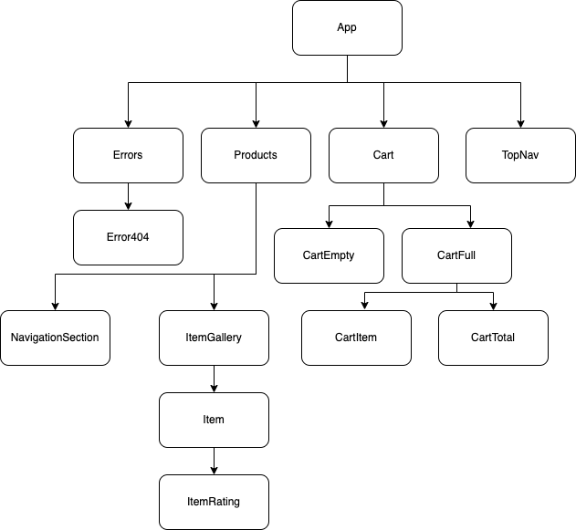
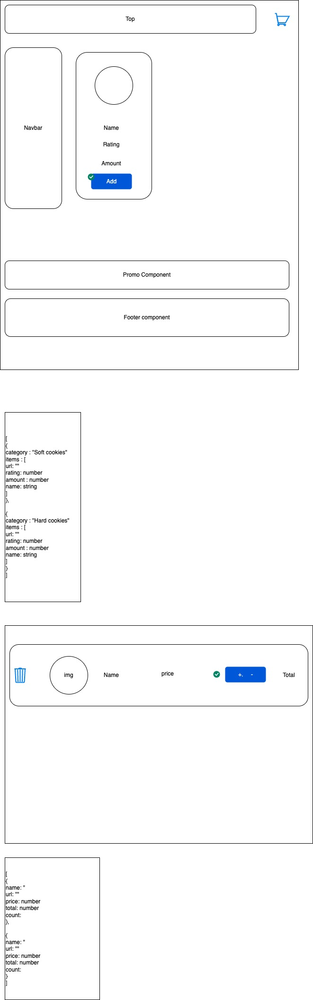

# React Cart

## To start the app

1. Clone the repo `git clone https://github.com/shaantalk/react_cart.git`
2. Install dependencies `npm i`
3. Start the server `npm start`
4. Navigate to [localhost:3000](http://localhost:3000/)

## Dependency Justification

1. Redux is used for client side storage
2. Redux-logger is used for logging
3. Redux-devtools-extension is used for debugging state changes
4. React-router-dom is used as router
5. Font Awesome for icons

## Component Heirarchy

## Frontend System Design

